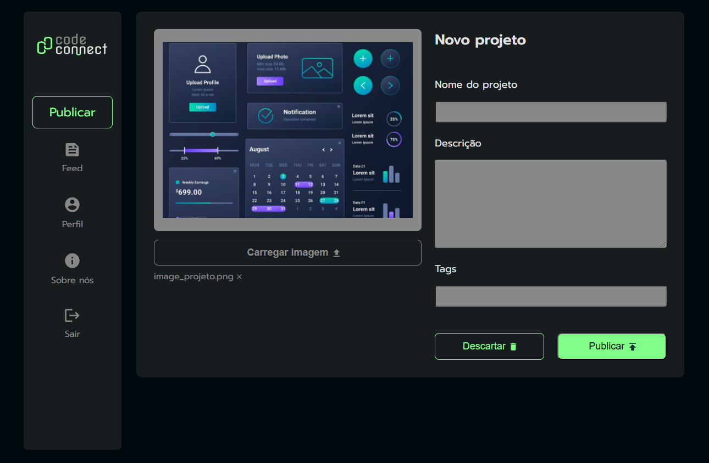

# CodeConnect
Projeto desenvolvido durante o curso de JavaScript: entendendo promises e async/await da Alura

## 🚀 Tecnologias

Esse projeto foi desenvolvido com as seguintes tecnologias:

- HTML e CSS
- JavaScript
   *  Funções assíncronas com async/await
   *  Promises
   *  Try... catch
   *  SetTimeOut
     

##  Preview em diferentes tamanhos de tela

  

